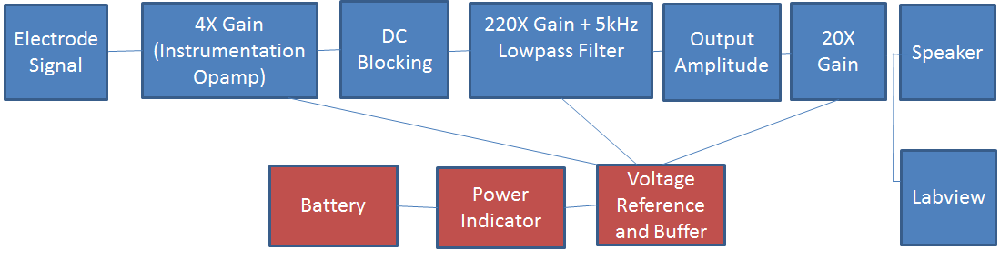
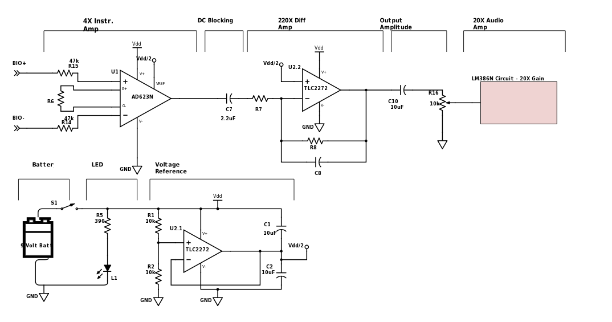

ELEC 240 Lab

------------------------------------------------------------------------

# EMG System

The EMG block diagram will look like this:

As you can see, there are multiple amplification stages of the signal sensed
by the electrodes, along with other blocks that alter the signal.  Each is
described below:

* **4X Gain Instrumentation Amplifier**: Instrumentation amplifiers are used
commonly in measurement and test equipment, for which the impedance is
unknown. Instrumentation amps have inbuilt input buffer amplifiers so no input
impedance matching is required. These amplifiers reject noise and are used
when accuracy is required. We will use an **AD623N** instrumentation
amplifier.

* **DC Blocking**: Any amplification stage will amplify both the AC and DC
signal. Since we are interested in the microvolt ac signal of the action
potentials, we will block the amplified dc voltage with a large value
capacitor.

* **220X Gain+5kHz** Lowpass Filter: This is the major gain stage of our EMG.
This amplification stage will be done using a **TLC2272** precision amplifier,
wired as a differential amplifier. This IC has two op amps within it so we
will use one for this stage and the other for the voltage reference circuit.
The **TLC2272** op amp can be wired to provide both gain and lowpass filtering.
Although the significant range of EMG signal is around 5-500 Hz, we will
design a lowpass filter to have a bandwidth of 5kHz for now.

* **Output Amplitude**: The amplified DC term will need to be filtered out
again with a big capacitor. Secondly, we can adjust the amplitude of the
signal with a potentiometer that will eventually control the volume out of our
speaker in the next stage.

* **20X Gain**: The speaker requires a special amplifier called a **LM386** 
which is an audio power amplifier. This op amp amplifies low power electronic
signals to a level strong enough for driving high power speakers.

* **Battery**: A 9-V battery will be used.

* **Power Indicator**: We can test whether our circuit is being powered by
placing an LED in parallel with the battery. The LED will light up when
current is being drawn from the battery.

* **Voltage reference and buffer**: The 220X gain amplifier requires a voltage
reference signal equal to $V_{ dd }/2$ when we use it as a differential amplifier. To
create this voltage $V_{dd}/2$ we can use the second opamp in the **TLC2272** IC as a
voltage buffer to create this voltage. Using an opamp instead of a voltage
divider allows us to create the desired voltage without the output (diff amp)
loading the input ($V_{dd}/2$ reference).

* **Speaker**: We will use the speakers from previous labs to hear the muscle
activity we are sensing.

* **Labview**: We will feed the bioelectrical signal to Labview to view what
it looks like and analyze its frequencies, using some of the techniques learned
this semester such as FFT.

### Schematic

This is a nearly complete schematic of our EMG:

Build up your circuit on your breadboard following the schematic shown above.
You will need to refer to the following datasheets to calculate some component
values, understand pinouts, and build some of the system blocks:

#### Datasheets:

* [AD623](http://www.analog.com/media/en/technical-documentation/data-sheets/AD623.pdf)
* [TLC2272](http://www.ti.com/lit/ds/symlink/tlc2272.pdf)
* [LM386](http://www.ti.com/lit/ds/symlink/lm386.pdf)
