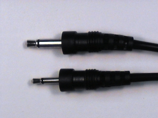
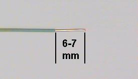

ELEC 240 Lab

------------------------------------------------------------------------

Experiment 2.2
--------------

Electroacoustic Transducers II
------------------------------

In this section we will discover different ways to detect and change a
signal.

### Equipment

* Test board
* Speaker
* Microphone

### Part A: Microphone

So far we have used an acoustic output device, the speaker, to convert
electrical signals to sound. Now we need an input device to convert acoustic
signals to electric ones.

1. Get a microphone from the supply room. It has two connectors: we will use
   the larger one:

    

    
    

2. Use a BNC patch cord to connect `CH1` of the oscilloscope to `J1-1` of the test
   board (refer to the [test board pin assigments](../references/interface)).

3. Plug the microphone into `J1-4` of the test board.

4. Take a piece of wire and strip 6-7 mm of insulation from each end. The end
   of the wire should look like this:
   
    

    
    

    !!! warning 
        The stripped length of a wire is very important. If it is too short,
        the insulation can prevent contact within the socket resulting in an
        intermittent connection. **THIS IS ONE OF THE MOST COMMON PROBLEMS IN
        THE LAB.** If it is too long, the exposed portion of the wire can short
        to other wires.

5. Plug one end of the wire to [pin1](../references/interface) and the other end
   to [pin 4](../references/interface). This will connect the microphone to the
   scope (`CH1`). The grounds are automatically connected by the test board.

    

    
    

6. Ensure the following settings on the oscilloscope:  

    * CH1
    * Volts/Div : 5mV
    * Time/Div: 1ms
    * 1X setting on CH1

7. Speak, sing, or whistle into the microphone and observe the signal on the
   scope. If the amplitude is too small, you can use the Volts / Div setting to
   get a little more resolution.

8. Experiment with the Time / Div settings to see what effect it has on the
   display.

9. Trigger: Drag the trigger icon (arrow followed by a T) just outside the
   signal display so that it crosses the signal. **What happens to the
   display?**

    * What is Trigger? The oscilloscope has to continually refresh its
      display since a continuous signal is being fed to it. If each "sweep"
      (refresh of data) started at a different place on the signal all we would
      get is a jumble of waveforms. The trigger sets an origin from which each
      sweep should start. That way, particularly for periodic signals, the new
      waveform traces onto the old waveform and the signal appears static.

10. Measure the amplitude of the signal.

11. Produce a sustained vowel sound. **Which appears most sinusoidal?**

12. Continue producing a sustained vowel sound and measure its frequency (by
    measuring the period).

13. If you are musically inclined, sing or whistle the note $A$ and measure its
    frequency. Otherwise search for the tone and play it on your phone. How
    does your measured frequency compare with the *official* value for the
    frequency of $A$? **If there is a discrepancy, explain why it might be.**

### Part B: The Lab PC as a Signal Source

The microphone is a device that converts an acoustic pressure into a voltage.
The Lab PC contains a device, the Sound Card, that converts a sequence of
numbers into a voltage. This sequence of numbers could represent the *samples*
of a physical signal that you learned about in ELEC 241.

Since the computer can compute functions and the sound card can produce
electrical output we could use the Lab PC as our 'function generator', which
can produce more interesting functions than our VirtualBench `FGEN` can.
Another advantage is that $R_{out}$ of the sound card is less than that of the
function generator, so we can connect the speaker directly with less signal
loss. Let's look at a few examples.

1. Plug the sound card cable from the Lab PC (with the [8-pin round
   connector](../misc_images/#din8)) into `J2-1` on the test board.

2. Connect a BNC clip lead to `J1-3` and the clips to the loudspeaker.

3. Connect the speaker to the sound card speaker output but connecting a piece
   of wire between pins 3 and 20 on the test board.

4. View the speaker output on `CH1` (connect a wire from pin 20 to pin 1).

5. Listen to and observe the waveform for the following signals:

    * [Signal 1](./signals/sine.au)
    * [Signal 2](./signals/gong.au)
    * [Mystery Signal](./signals/shepard30.au)

6. We'll look at this signal again in a few weeks when we have some more
   sophisticated analysis tools. In the meantime, based on what you can hear
   and what you can see on the scope, **can you figure out the trick?**

7. Disconnect speaker and sound card cable.
