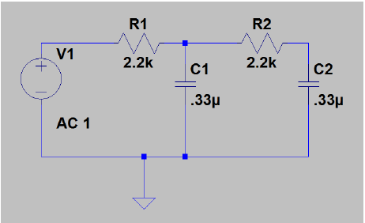

ELEC 240 Lab

------------------------------------------------------------------------

Experiment 3.2
--------------

Filters and Transfer Function
-----------------------------

### 

### Equipment

* Test board
* $2.2 k\Omega$ Resistor
* $0.33 \mu F$ [Capacitor](../misc_images/#ceramic-caps2)

### Part A: Measuring the Transfer Function

Measuring the transfer function of an RC circuit is considerably more involved
than measuring the attenuation of a resistive voltage divider.  We have to make
the measurement at a number of frequencies, and we must measure phase as well
as amplitude.

1. Select a 2.2 $k\Omega$ Resistor and a 0.33 $\mu F$ [Capacitor](../misc_images/#ceramic-caps2).

    !!! note
        Ceramic capacitors use the same labeling codes as the
        potentiometers except that the units are picofarads ($pF$) instead of
        ohms. So a 0.33 $\mu F$ capacitor would be a 330,000 $pF$ capacitor which would
        have the code 334 = $33*10^4$.

2. Wire the following circuit:
    

    
    

3. Connect the `FGEN` to supply $v_{in}$ and the oscilloscope to measure $v_{out}$.

4. Using the technique described in the previous section, measure the frequency
   response of the circuit at the following frequencies: 20 Hz, 50 Hz, 100 Hz,
   200 Hz, 500 Hz, 1 kHz, 2 kHz, 5 kHz, 10 kHz, and 20 kHz.

5. **Plot the magnitude of the transfer function vs. frequency** on loglog axes
   and the phase on semilog axes. This can be done by hand or in Matlab.

6. Using Matlab, compute and plot the expected transfer function for the
   circuit you built. **How well does this compare with what you measured?**

    !!! caution
        Leave this circuit assembled. We will use it in the next experiment.

### Part B: Circuit Simulation

The remainder of the lab can be done from a computer (lab computer or personal
laptop). We will be using circuit simulation software called LTSpice. Spice
stands for (Simulation Program with Integrated Circuit Emphasis).

1. Open LTSpice which is installed on the lab computers. If you are using a
   personal laptop, you can download LTspice [here](https://linear.com). There
   are Windows and Mac versions available.  Please note that the instructions
   below are specifically for Windows.  

2. Click on New Schematic and create the same circuit you built on your
   breadboard by following the [instructions](../references/using-spice) on
   spice provided in the references section.

3. Perform an AC analysis using the
   [instructions](../references/using-spice/#performing-an-ac-analysis)
   provided in the references section.

4. **Take a screenshot of your plots.**  

5. **What is the gain at low frequencies (1Hz)? Indicate the gain in dB as well
   as in V/V.** This is called the DC gain.  

6. **At what frequency does the gain fall 3dB below DC gain?** Thare are many
   names for this frequency including 3dB, cutoff, or corner frequency. It is
   also called the half-power frequency, because at this frequency, the output
   power has dropped to half of its peak value. This half-power frequency
   defines the *bandwidth* of the filter.  

7. Notice how the gain plot is linear with a negative slope beyond the cutoff
   frequency. **What is the slope of the gain plot at high frequencies
   ($>1kHz$)? Express in terms of $dB/dec$.** This is called the *gain
   rolloff*.  

8. What is the phase for very low frequencies? And for very high frequencies?
   **Can you explain why?**  

9. Now cascade another lowpass filter to your circuit:
    

    
    
  

10. Run an AC Analysis of this new circuit, and click on its output node to
    display gain and phase plots (the output will be at the node between R2 and
    C2). **Take a screenshot of your plot. What is the new gain rolloff
    ($dB/dec$)? The phase at low and high frequencies?**  

11. **Did the cutoff frequency change?**  

12. **What are the pros and cons of cascading two identical filters?**
