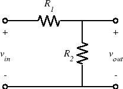
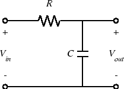

### ELEC 240 Lab

# Introduction
In the last 2 labs we looked at various kinds of signals: DC, sinusoidal, square waves, speech, etc. But to build our optical communication system, we will have to do more than look. We need to be able to manipulate signals so that we can impress the desired information onto a &quot;carrier" signal to transmit it and then extract the information from the received signal. Another term for this signal manipulation is *signal processing*.  

For this lab you will need to be familiar with MATLAB, so it is advised to look over some online tutorials.

The following figure shows the basic voltage divider circuit:  

for which we have the familiar relation: $v_\text{out} = \frac{R_2}{R_1 + R_2} v_\text{in}$ or $\frac{v_\text{out}}{v_\text{in}} = \frac{R_2}{R_1 + R_2}$. If $R_1$ and $R_2$ are fixed then the output voltage is a constant fraction of the input, i.e. we have a fixed attenuator. If either or both of them vary, we have a variable attenuator (e.g. a volume control). If $v_\text{in}$ is constant and one or both of $R_1$ or $R_2$ vary with time, then $v_\text{out}$ will be a function of time, following the change in $R$. If either or both of $R_1$ and $R_2$ vary with frequency (i.e. they are impedances rather than pure resistances) then the attenuation (or transfer function) will be a function of frequency, i.e. we have a *filter*. Finally, if one or the other of $R_1$ or $R_2$ is non-linear, then the input-output relation will reflect that nonlinearity.  

If we replace resistances $R_1$ and $R_2$ by impedances $Z_1$ and $Z_2$ and use the phasor representation ($V_\text{in}$ and $V_\text{out}$) for the input and output voltages, then the voltage divider relation still holds. We define the ratio of the output voltage phasor to the input
voltage phasor to be the *transfer function*:  

$H(f)\equiv\frac{V_\text{out}}{V_\text{in}} = \frac{Z_2}{Z_1 + Z_2}$

    

For example if we replace $R_2$ with a capacitor, we get the following
circuit:  

    

for which $H(f)=\frac{V_\text{out}}{V_\text{in}} = \frac{Z_2}{Z_1 + Z_2} = \frac{1/j2\pi fC}{(1/j2\pi fC)+R} = \frac{1}{j2\pi fRC+1}$.  

Since $H(f)$ is close to one for small values of $f$ and goes to zero for large $f$ (i.e. it passes low frequencies) we call this circuit a *low pass filter*.

<!--Basically, signal processing is simply doing math on signals:
adding or multiplying them together, scaling them to make them
smaller or larger, filtering them to make them &quot;smoother"
or to separate a desired signal from an undesired one.
In this Lab and the next we will begin investigating basic signal
processing operations including attenuation, amplification,
and filtering.

Another theme of the first two labs was the study of
<em>components</em>.
With this lab we will begin studying
<em>circuits</em>,
or combinations of components.
The simplest circuit
(well, maybe the second simplest)
is the
<em>voltage divider:</em>
just two resistors
(or more generally two impedances)
in series.
Yet this simple
configuration is the heart of some of the most important circuits
in all of EE.

Combined with the notion of Th&eacute;venin equivalence,
it describes the behavior of subsystems when they are interconnected.
It is the basis for
attenuators, filters, amplifiers, logic gates,
many types of transducers,
and a host of other functions that make up electronic systems.

In this lab we will look at a number of basic circuits
(all derived from the voltage divider)
and see how we might use them in processing
(and originating) signals.-->

