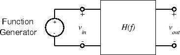
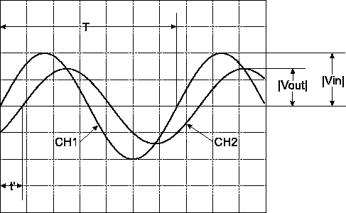

ELEC 240 Lab

------------------------------------------------------------------------

Interlude
---------

Measuring the Transfer Function
-------------------------------

Consider an RC circuit connected to a sinusoidal voltage source on one end and
some load on the other end. The RC circuit alters the signal coming from the
source that reaches the load. How that signal is altered is described by a
transfer function.

An RC circuit is an example of a linear, time-invariant (LTI) circuit.  An LTI
circuit can alter the magnitude and phase of the input sinusoidal signal but
not the actual frequency.

Mathematically, an expression can be created to describe this transfer
function: it is the ratio of the load voltage (or output) to the source voltage
(or input). When it comes time to measure the actual transfer function in the
lab, things are a bit harder.

One obvious difficulty is that instead of simply making the measurement at a
single frequency (e.g. zero), we have to make it at *all* frequencies, a rather
daunting task. Fortunately, the function we expect to get is well behaved, so a
few judiciously chosen frequencies should suffice.

The other problem is that we have to measure both the magnitude and the phase
of the input and output signals. We already know how to measure magnitude.
Let's see if we can figure out how to measure phase.

We will use the following technique:

1.  Connect the function generator to the input of the system being
    measured:

    

    
    

2.  Connect `CH1` of the scope to $v_{in}$ and `CH2` to $v_{out}$.

3.  Make sure both `CH 1` and `CH 2` (red and yellow) are displaying on the
    oscilloscope.

4.  Set both channels to `DC`. In a case where there is a DC offset on either
    the input or the output, set the corresponding switch to `AC`. If you do
    so, be aware that this will influence the low frequency portion of the
    measurement (below about 20 Hz).

5.  Overlay both traces on top of each other and set your display window such
    that 1-2 cycles of the sinusoids appear.

6.  Set the function generator frequency to the first frequency to be
    measured, say $f_1$, until the display looks similar to this:

    

    
    

    In particular, you should have just over one cycle of the input waveform
    displayed. Pick a salient feature of the sinusoid (i.e., the max point, or
    upward x-axis crossing) measure the time delay between when they occur on
    the input and output sinusoids. Use the cursor feature of VirtualBench and
    click on the ruler for exact measurement values.

Let's see what we've got:

1.  By measuring the height of the peaks of `CH1` we get
    $\vert V_\text{in}\vert$.
2.  Similarly, the peaks of `CH2` give
    $\vert V_\text{out}\vert$.
3.  Calculate $\vert H(f_1)\vert = \frac{\vert
    V_{out}\vert}{\vert V_{in}\vert}$.
4.  Measure $t'$, the distance between successive zero crossings of
    the same slope. This zero crossing corresponds to $\sin(2\pi
    f_1 t)=0$ for $v_{in}$ and $\sin(2\pi f_1 t' +
    \phi)=0$ for $v_{out}$, where $\phi = \angle H(f_1)$.
    So we have $2\pi f_1 t' + \phi = 0$ or $\phi = -2\pi f_1
    t' = -2\pi t'/T$, where $T$ is the period of the waveform.
    This gives the phase in radians. To express the phase in degrees, we
    would use: $\angle H(f_1) = -360\frac{t'}{T}$

This gives us the magnitude and angle of the transfer at a single
frequency, $f_1$. To get the complete transfer function, we repeat
the procedure at different frequencies.
