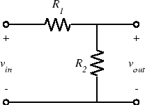

### ELEC 240 Lab 

# Introduction 

In the last 2 labs we looked at
various kinds of signals: DC, sinusoidal, square waves, speech, etc. But
to build our optical communication system, we will have to do more than
look. We need to be able to manipulate signals so that we can impress
the desired information onto a "carrier" signal to transmit it and then
extract the information from the received signal. Another term for this
signal manipulation is *signal processing*. For this lab you will need
to be familiar with MATLAB, so it is advised to look over some online
tutorials. The following figure shows the basic voltage divider circuit:

for which we have the familiar relation: 

$$ 
v_{out} = \frac{R_2}{R_1 + R_2}v_{in} \text{  or  } \frac{v_{out}}{v_{in}} = \frac{R_2}{R_1 + R_2}
$$

If $R_1$ and $R_2$ are fixed then the output voltage is a constant fraction of
the input, i.e. we have a fixed attenuator. If either or both of them vary, we
have a variable attenuator (e.g. a volume control). If $v_{in}$ is constant and
one or both of $R_1$ or $R_2$ vary with time, then $v_{out}$ will be a function
of time, following the change in $R$. If either or both of $R_1$ and $R_2$ vary
with frequency (i.e. they are impedances rather than pure resistances) then the
attenuation (or transfer function) will be a function of frequency, i.e. we
have a *filter*. 

Finally, if one or the other of $R_1$ or $R_2$ is non-linear, then the
input-output relation will reflect that nonlinearity. If we replace resistances
$R_1$ and $R_2$ by impedances $Z_1$ and $Z_2$ and use the phasor representation
($V_{in}$ and $V_{out}$) for the input and output voltages, then the voltage
divider relation still holds. We define the ratio of the output voltage phasor
to the input voltage phasor to be the *transfer function*:

$$
H(f)\equiv\frac{V_{out}}{V_{in}} = \frac{Z_2}{Z_1 + Z_2}
$$ 

For example if we replace $R_2$ with a capacitor, we get the following circuit:

for which 

$$
H(f)=\frac{V_{out}}{V_{in}} = \frac{Z_2}{Z_1 + Z_2} = \frac{1/j2\pi
fC}{(1/j2\pi fC)+R} = \frac{1}{j2\pi fRC+1}
$$

Since $H(f)$ is close to one for small values of $f$ and goes to zero for large
$f$ (i.e. it passes low frequencies) we call this circuit a *low pass filter*.
