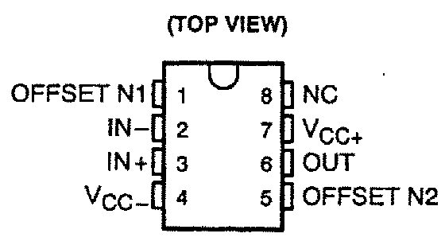
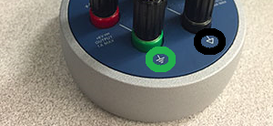
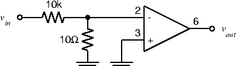
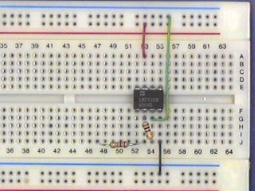

ELEC 240 Lab

------------------------------------------------------------------------

Experiment 4.1
--------------

The 741 Op-Amp
--------------

### 

### Equipment

* 741 Op Amp
* 10 Ω Resistor
* 10 kΩ Resistor
* 100 Ω Resistor

### Part A: Powering up the 741 Op Amp

The 741 operational amplifier, or op-amp, comes in an 8-pin dual inline package
(DIP) which looks like this:  

  

If you look closely at the package, you will find a notch at one end or a dot
in one corner. This tells us how to find Pin 1: the dot is located next to Pin
1 and the notch is located between Pins 1 and 8. The rest of the pins are
numbered like this:  

  

Pin 8 is not connected (NC). Pins 1 and 5 are used to eliminate the offset
voltage. We won't be using this feature, so don't connect anything to these
pins. The remaining pins give us the following circuit symbol for our op-amp:  

For more information, see the [741 data
sheet](http://www.ti.com/lit/ds/symlink/lm741.pdf).  

In order to function, the op-amp must be connected to an external *power
supply*. Since we want to produce both positive and negative output voltages,
we need both positive and negative voltages for the power supply. These are
labeled $V_{CC+}$ and $V_{CC-}$ on the diagram. For a 741, the nominal values
are $V_{CC+} = 15 V$ and $V_{CC-} = -15 V$.

To avoid clutter, we won't show the power supply terminals (pins 4 and 7) on
any of the subsequent circuit diagrams. *However, pins 4 and 7 must be
connected to the power supply or your amplifier will not operate.*

Note that there is no ground terminal on the op-amp. The zero reference point
is established by the external circuit and is not important to the op-amp
itself.

1. If you have not already done so, wire the bus strips on your breadboard to
   provide positive power, negative power and ground buses.  Whatever color
   scheme you have chosen for your wires, you should use the green binding post
   for ground, the black for $-15 V$, and the red for $+15 V$.

2. Plug an op-amp into the breadboard so that it straddles the gap between the
   top and bottom sections of the socket strip (see picture below). If you have wired the power
   buses as suggested above, Pin 1 should be to the left.

    !!! caution 
        Do not try to unplug the op-amp with your thumb and
        forefinger. It's a good way to end up with the op-amp plugged into your
        fingertip. Use the pliers or [IC puller](../misc_images/#ic-puller)
        from your toolkit.

3. Connect Pin 4 ($V_{CC-}$) to the negative power supply bus ($-15 V$).
   Connect Pin 7 ($V_{CC+}$) to the positive power supply bus ($+15 V$).  

    

    
    

4. In VirtualBench, there are three power supplies, labeled $+6V$, $+25V$, and
   $-25V$, which indicate their max output voltages. Set the $\pm 25V$ supplies
   to $\pm 15V$. Turn the power supply on, and use your DMM to verify that the
   output from the power supply dongle is what you set it at. 

5. Temporarily turn off the supply. Using banana plug patch cables, connect the
   $-25V$ terminal to the black binding post on your breadboard and the $+25V$
   terminal to the red breadboard binding post. To make a ground connection,
   connect the *common* terminal (circled in black) to the *ground* terminal
   (circled in green) with a banana plug patch cable. Use a second banana plug
   patch cable to connect the common terminal to the green breadboard binding
   post.

    

    
    

### Part B: Open-Loop Response

1. With the power turned off, wire the following circuit. Note that the input
   to the op amp is a $1000:1$ voltage divider, so that a $1 V$ signal at
   $v_{in}$ results in a $1mV$ signal at the input of the op-amp.

    !!! caution
        The components we've used so far have been simple (only two terminals)
        and fairly rugged (connecting a resistor or capacitor "backwards" won't
        harm it). The op-amp has four times as many pins, so it's easier to
        make a mistake in wiring it. Unfortunately, it's also considerably more
        delicate, so connecting it incorrectly can destroy it (often without so
        much as a puff of smoke to let you know that it has become an
        inoperational amplifier. Always wire your circuit with the power
        turned off and check your wiring carefully before turning the power
        on.

        

          

        
        

2. Set the function generator to produce a $2 V_{pp}$, 20 Hz sine wave.

3. Connect the function generator output to $v_{in}$ of the circuit above.
   Connect `CH1` of the scope to $v_{in}$ and `CH2` to $v_{out}$. Set the `CH2`
   `VOLTS/DIV` to 5. Make sure both channels of the scope are on DC.

    !!! note
        You should see a badly distorted (clipped) waveform at $v_{out}$. If you
        don't, try increasing the function generator output.

4. Adjust the distorted waveform (will look like a square wave) so that it is
   symmetric about the x-axis. **Note the positive and negative peak values of
   $v_{out}$.**

5. Connect a 100Ω resistor from $v_{out}$ to ground. **What happens to the
   output signal?**

6. Remove the 100Ω resistor from the op amp output.

7. Set the FGEN to square wave. **Now what is the shape of the $v_{out}$
   waveform?** Does the output change slope as fast as the input does? This is
   called slew-rate limiting.

8. Make sure the DC offset on the FGEN is zero. **Does the output also show
   zero DC offset?**

    !!! note
        We have just seen a number of the shortcomings of a real (as opposed to
        an ideal) operational amplifier: clipping, which limits the maximum
        amplitude of the output; slew-rate limiting, which limits the maximum
        slope of the output; and offset, which gives a non-zero output for zero
        input.

        When we reduce the overall gain with feedback, some of these (e.g.
        offset) are reduced significantly, and we get an output which is a
        faithful reproduction of the input. However, other limits (such as
        maximum output level) must be respected for this fidelity to remain.

9. **Summarize why, if we want to amplify our signal with an op-amp, operating
   it in open loop is not the ideal solution.**
