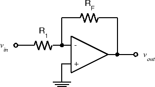

ELEC 240 Lab

------------------------------------------------------------------------

Experiment 4.2
--------------

The Inverting Configuration
---------------------------

### 

### Equipment

* 741 Op Amp
* 10 kΩ Resistors (2)

As we saw in the previous experiment, the op-amp isn't very useful in an
"open-loop" configuration (i.e. without feedback). The most common
configuration for op-amp circuits is the *inverting amplifier* where the output
is an amplified and inverted version of the input (i.e. $G$ is negative).

### Part A: The Basic Inverting Amplifier

1. Wire the following circuit using 10 kΩ resistors for both $R_1$ and $R_F$.

    

    
    

2. Set the function generator to produce a 1 V p-p, 100 Hz sine wave.  Measure
   the voltage gain, $G_v =V_{out}/V_{in}$. Since 100 Hz is within the
   frequency range of the DMM, you could use either the DMM or the scope to
   measure $V_{out}$ and $V_{in}$. However, you should always use the scope to
   *view* the waveform being measured to make sure it is what you think it is.
   We will see several waveforms in this lab that aren't.

3. Note that the output is inverted with respect to the input. **Take a
   screenshot for your report.**

4. Replace $R_F$ with a 100 kΩ resistor. **Measure the gain.**

5. Increase the input amplitude until output clipping occurs. **What is the
   clipping level? Is it the same as in Exp. 4.1?**

6. Reduce the input amplitude until the output is $20 V_{pp}$.

7. Increase the frequency until the output amplitude drops to $10 V_{ pp }$.
   **You should see a triangular output waveform**. This is because there is a
   limit to the maximum rate at which the output voltage can change, called the
   *slew rate.* **Set the input to triangle and square wave and see how the
   output changes.**

8. Reset the function generator for a 100 Hz sine wave and reduce the amplitude
   to produce a $1 V_{ pp }$ output. Again increase the frequency until the
   output is $0.7 V_{ pp }$. **At what frequency does this occur?** Observe
   that the output is still sinusoidal. This is the actual cutoff frequency or
   *bandwidth* of the amplifier.
