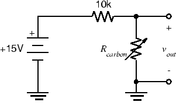

ELEC 240 Lab

------------------------------------------------------------------------

Experiment 4.3
--------------

Transducer Amplifiers
---------------------

### 

### Equipment

* Test board
* 741 Op Amp
* 10 kΩ Resistors
* 100 kΩ Resistors
* Other resistors according to your design
* 0.1 µF Capacitor
* Dynamic microphone
* Telephone handset

In Lab 2 we saw that our input transducers (microphone and photodiode) produced
signals of only a few millivolts, while our output transducers (speaker and
LED) required signals of a few volts. To make up this discrepancy, we need to
amplify the signal levels produced by the input transducers.

### Part A: Photodiode Amplifier

The inverting op-amp circuit works by taking the current that flows into the
"virtual ground" at the inverting input and forcing it to flow in the feedback
resistor. Since the voltage across $R_F$ is equal to $R_FI_F$, the output
voltage (on the other terminal of $R_F$ is proportional to the current flowing
into the virtual ground. What if instead of this current originating from the
voltage across $R_1$, it instead came directly from a current source? Well, the
output voltage would still be proportional to it: $v_{out} = -R_FI_F =
-R_FI_{in}$, i.e., we have an amplifier which accepts a current as an input and
produces a voltage as an output. This is called a *transresistance amplifier*.
(Since a resistance converts its current to a voltage ($v=Ri$), a
transresistance converts a current in one part of the circuit to a voltage in
another.)

In Lab 2 we measured the *voltage* across the photodiode and found some fairly
distorted waveforms. It turns out that the *current* produced by a photodiode
is proportional to the intensity of the light falling on it, while the voltage
is proportional to the *logarithm* of the intensity, hence the distortion. If
we could produce an output signal proportional to the photodiode current, we
would have a much better transducer.

1. Wire the following circuit. (You can modify the previous circuit by removing
   the 10 kΩ resistor and replacing it with the photodiode (connected to ground
   rather than to the function generator)).

   

   
   

2. As you did in Lab 2, note the output voltage, $v_{out}$, and observe how it
   changes as you cover and uncover the photodiode with your hand.

3. Set the function generator to produce an $8 V_{ pp }$, 100 Hz triangle wave.

4. Disconnect the BNC patch cord from the function generator output and connect
   the BNC clip leads. Connect your red LED to the clip leads (like you did
   with the photodiode in Exp. 2.3 Part B).

5. Hold the LED directly above the photodiode and observe $v_{out}$. **Is it
   less distorted than in Lab 2?** Switch the function generator to sine wave
   and observe the waveshape.

6. Switch the function generator to square wave and increase the amplitude to
   maximum. Slowly separate the LED from the photodiode, adjusting the
   alignment to maintain the best signal (just like Lab 2).  What is the
   maximum distance you can get with this configuration and still get a
   recognizable square wave signal? **How does it compare with what you got in
   Lab 2?**

7. Remove the BNC clip leads, reduce the amplitude of the function generator,
   and reconnect the BNC patch cord. Unplug the photodiode.

8. **Analyze the transresistance amplifier using the op-amp design rules and
   show that $v_{out} = R_Fi_d$.**

### Part B: Microphone Amplifier

The microphone we used in Lab 2 is called a *dynamic* microphone. The
microphone that is housed in a telephone handset is called a *carbon-button*
(or *carbon* for short) microphone. The output of the carbon microphone is
close to our standard $1 V$ level, but for the dynamic microphone to be useful,
we will need to amplify its output. If we don't mind the change of sign (which
we don't for this application), we have just the circuit we need.

We will use this circuit in several subsequent labs, so build it in a
convenient part of the breadboard (see discussion in [Organizing your
Breadboard](./organizing-your-breadboard)) and leave it assembled when lab is
over.

1. Look back in your lab report to find the value you measured for the output
   voltage of the dynamic microphone. **Calculate the gain $G$** required to
   amplify this to a $1 V_{ pp }$ signal.

2. **Calculate the value of $R_1$** that will give the circuit below a
gain of $G$:

    

    
    

3. Wire the above circuit by modifying your circuit from Part A, and
connect $v_in$ to J1-6-left (Pin 8 on the Interface Board socket strip).
Plug the dynamic microphone into J1-6.

4. Speak into the microphone and observe $v_{out}$. Does it have the amplitude
   you expected? If not, adjust $R_1$ until $v_{out}$ is approximately $1 V_{ pp
   }$ when speaking in a normal voice.

### Part C: Mixer

We want to be able to use both the dynamic microphone and the carbon
microphone. We could build separate amplifiers for each and switch back and
forth, but it would be more convenient to be able to use either one (or both)
with no changes to the circuit.

Since Kirchhoff's Current Law must hold true at the negative input/virtual
ground, if more than one current source is connected to it, the output voltage
must be proportional to the sum of the currents.  Consider the following
circuit:

1. **Show in your report that the output is a weighted sum of its inputs**, in
   other words:

    $$
    v_{out} = - \left( \frac{R_F}{R_1}v_1 + \frac{R_F}{R_2}v_2 \right)
    $$

    We can use this circuit as a *mixer* to amplify both the dynamic microphone
    output and the carbon microphone output by the appropriate amount, and then
    combine them into a single signal.

2. First construct the carbon microphone interface.

    !!! note 
        The carbon microphone is a resistive, or passive transducer.  This
        means that it doesn't convert acoustical energy to electrical energy
        directly, but instead the acoustical energy varies some electrical
        parameter (i.e., resistance). In order to interpret this change in
        resistance, the transducer needs to be powered by an external source
        which then produces a voltage output corresponding to the change in
        resistance. We do this by powering the carbon microphone with a voltage
        source in series with a large resistor (i.e., creating a voltage
        divider circuit).

    The following circuit should do nicely. Wire this circuit to the right of
    your dynamic microphone amplifier, and we will connect the two in a couple
    of steps. (The carbon microphone is pins 12 and 13 on the interface
    connector. There is a ground on pin 14).

    
  
  

3. Plug the handset into J1-7. Speak into the handset microphone and verify
   that the above circuit works. Speak in the same normal voice you used for
   the dynamic microphone and **measure the peak-to-peak amplitude of the
   signal**.

4. We need to get rid of the pesky DC offset in the carbon microphone output.
   On the scope we can do this by switching to the AC position. Or instead, we
   can put a capacitor in series with the input. Putting it all together gives
   us the following circuit:

    

    
    

5. **Compute the value of $R_2$** required to give an output of $1V_{ pp }$.
   Put together your two subcircuits and create the above circuit.

6. Speak into each microphone and verify that $v_{out}$ is about $1 V_{ pp }$ in
   each case.

7. Since the op-amp can drive a 100Ω resistance to more than our standard
   voltage level, and since the handset earpiece resistance is greater than
   100Ω, we should be able to drive it from the op-amp output. Connect one side
   of the earpiece (Pin 11 on the interface board) to ground (Pin 14).  Connect
   the other side (Pin 10) to $v_{out}$. Have your lab partner speak into the
   dynamic microphone while you hold the handset to your ear and speak into its
   microphone. Verify that both voices are audible simultaneously.

    !!! caution
        Do not dissemble this circuit. We will use it in subsequent labs.
