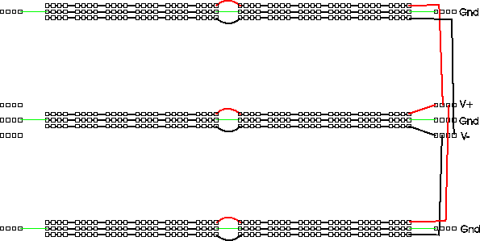

ELEC 240 Lab

------------------------------------------------------------------------

Prelude
-------

Organizing Your Breadboard
--------------------------

The first three Labs have been something of a "warmup" in terms of utilizing
the breadboard. We've used only one or two of the interface components at a
time and we've built circuits consisting of 2 or 3 components which we've
disassembled at the end of lab. With this Lab we will begin constructing more
complicated circuits having more external connections. Since some of these will
perform functions we will need in other Labs, we will want to leave them in
place on the breadboard for future use. To keep this from degenerating into
chaos, we need a plan for organizing the layout and wiring on the breadboard
and interface board.

There are several aspects to this organization ranging from small details to
the big picture.

#### Color Coding

There are different colored wires available to use. You could just pick pieces
of wire at random, or you could try to use the different colors to designate
different signals. There aren't enough colors for each signal to have its own,
but you can use different colors to denote different classes of signals.

One set of signals you should color code are power and ground. In particular,
you should have a different color for $+15 V$, $-15 V$, and ground and you should
not use any of these colors for other signals. It would be nice to use
"standard" colors for these, but unfortunately there are several competing
standards. One color that nearly everyone agrees on is that red should be the
positive power supply voltage. Most automotive and electronic wiring uses black
to denote ground. Electronic wiring which uses black for ground often uses blue
for the negative supply. However, our power supply and breadboard use green to
denote ground (the convention used in house wiring) and use black to denote the
negative supply.

So we have two possible "standard" color codes for power: 

1. red = +, green = gnd, black = -
2. red = +, black = gnd, blue  = -

You could use either of these, or make up your own. The pictures in this lab
use set 1.

Another useful thing to color code would be the wires or "probes" from the
interface board connector. That way you can tell which wire is `CH1` of the
scope or which is the function generator output without having to trace from
one end of the wire to the other.

#### Power Bussing

Each of the power bus strips has three rows of contacts, so we can distribute
ground, $+15 V$, and $-15 V$ throughout the entire breadboard area. Remembering
to connect the two halves of each row together, we get the following layout for
power:

#### Interface Board Connector Assignments

Some of the connectors on the Interface Board are dedicated to a single
function (e.g. the telephone handset or the sound card). Others (e.g.  the BNC
and phone jacks) are more flexible and may be connected to a variety of signal
sources or destinations. It will be helpful to establish standard assignments
for these connectors as well.

In the instructions and photographs, we will be using the following assignment:

| **Connector** | **Socket Pin** | **Signal** |
|---------------|----------------|------------|
| J1-1 | 1 | Oscilloscope channel 1|
| J1-2 | 2 | Oscilloscope channel 2|
| J1-3 | 3 | Function generator output |
| J1-6 | 8 | Microphone|

#### Overall Layout

When building a fairly complex circuit like you will in Lab 10, involving at
least 4 op-amps and a dozen or so resistors and capacitors, good engineering
practice is to break down a complex system into a number of simple subsystems,
each of which performs a single, well-defined function.

In the unlikely event that your circuit does not work perfectly the first time
you turn it on, it will make it easier for you (and your labbie) to debug it if
each of these subcircuits is laid out (neatly, of course) on its own little
patch of breadboard and is connected to the other subcircuits in such a way
that it may be easilly disconnected from them for testing in isolation.

One of the circuits we will build this week, the microphone amplifier and
mixer, will be used in most of our subsequent labs. You should put it in a
location which will will not get in the way of building other circuits, but
will be convenient for connecting to the interface board and these other
circuits. The righthand quarter of the top socket strip is a good location.
