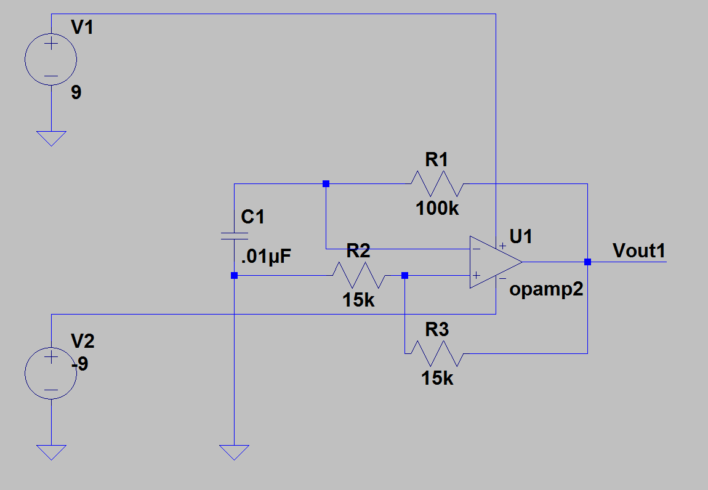
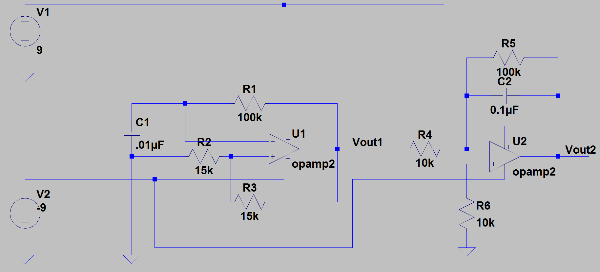

ELEC 240 Lab

------------------------------------------------------------------------

Experiment 5.1
--------------

Function Generator
------------------

### Equipment

* Test board
* LM741 (4x)
* Resistors according to your design
* Capacitors according to your design

### Part A: Build a Function Generator

In this lab experiment, we will be building our own function generator using
two new types of op amp circuits.

1. Wire up the following RC relaxation oscillator circuit (see Introduction to
   read about its functionality):  

    

    
    

    * **Is the output as expected? Provide a screenshot in your report.**  

    * **What is the frequency of oscillation?**  

    * **The frequency should be equal to $f = \frac{1}{2.2*R1*C1}$. Is
      this what you measure?**  

    * **Does the frequency change as expected when R1 is changed?**  

2. Cascade an integrator circuit to the output as shown below:  
    
    

    
    

    * **Is the integrator working as expected? Explain and provide a
      screenshot.**

3. **Measure the DC offset of `Vout2`**

    !!! note
        DC offset is the average voltage of your waveform.

4. Eliminate the DC offset by placing a DC blocking capacitor (any capacitor
   between $0.1\mu F$ and $1\mu F$) in between the RC relaxation oscillator and
   integrator. **Provide a screenshot.**

5. Now add on to your circuit so that it also generates a sinusoid.  **Provide
   a screenshot.**

6. Build a gain stage to your circuit to modulate the amplitude of your
   sinusoidal output.
