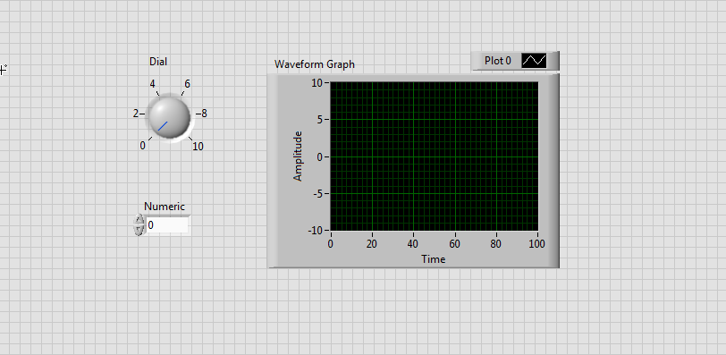
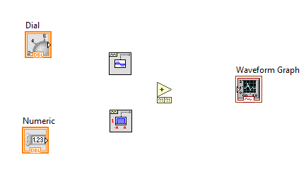
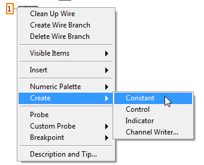
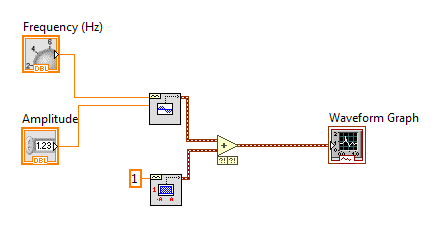
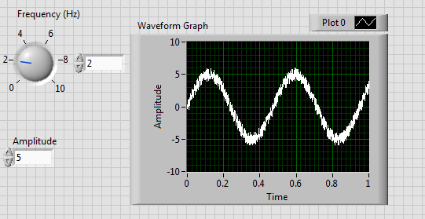
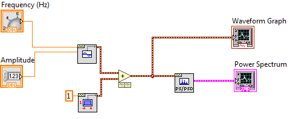
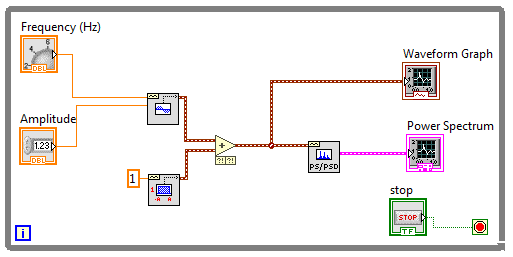

ELEC 240 Lab

------------------------------------------------------------------------

Experiment 5.1
--------------

Virtual Instruments with Labview
--------------------------------

### 

### Equipment

* Lab PC

### Part A: Generating a Signal

In this section, you will learn how to use the software Labview (installed on
your lab PC) to analyze the frequency content of a signal. The frequency
content can be viewed by plotting the signal's frequency spectrum. The spectrum
of a sine wave should be pretty boring. By definition it consists of a single
component at the fundamental frequency whose amplitude is equal to the
amplitude of the waveform. Nevertheless, it is useful being able to see the
amplitude and frequency in a single picture, as well as being able to assess
how "pure" (i.e. how truly sinusoidal) the purported sine wave actually is.

1.	From the Start menu, open the program NI Labview 2016. Click on Start
    Labview.
2.	In the window that opens up, select Create Project, and then select Blank
    VI.

    !!! note
        VI stands for Virtual Instrument. Labview is a versatile software tool
        that allows you to custom-build instrumentation that can acquire,
        generate, process, and analyze signals according to your design needs.

3.	Two windows will pop up, one titled Front Panel and the other titled Block
    Diagram. Let's first create the Front Panel of your virtual instrument,
    so bring that window to the foreground, which should also bring up a
    Controls palette window. 

    !!! note
        If the Controls palette does not pop up automatically, you can open it
        by selecting View $\rightarrow$ Controls Palette, or by right-clicking
        on a blank area of the front panel.

4.	The Controls palette contains objects that can be added to form the user
    interface. There are two types of objects: controls and indicators. A
    control is an input from the user that gets passed to the virtual
    instrument, while an indicator is an output display (numeric or plot), from
    the virtual instrument. From the Controls palette, select Modern
    $\rightarrow$ Numeric $\rightarrow$ Dial. Left-click on the Front Panel to
    place the dial onto the panel.

5.	Next, place a Numeric Control from the Numeric subpalette.

6.	Then from the Control palette, select Modern $\rightarrow$ Graph
    $\rightarrow$ Waveform Graph. Your Front Panel should like the figure
    below:

    

    
    

    !!! note
        Waveform Graph accepts and plots an array of data values all at once.
        This is different from Waveform Chart, which scrolls data continuously
        and refreshes the display as new data is added.

7.	Now click on the Block Diagram window to bring it up. You should see three
    nodes already placed on it, which correspond to the objects placed on the
    Front Panel.

    !!! note
        Notice the small black arrows which indicate the direction of data flow
        (into or out of the node). Nodes are color-coded, which indicates the
        data type. In this case, the nodes are orange, the color code for
        floating point. The DBL marking indicates double precision.

8.	You should now see a Functions palette in place of the Control palette.
    Under the Programming subpalette, select Waveform $\rightarrow$ Analog Wfm
    $\rightarrow$ Generation $\rightarrow$ Sine Wfm and place it on the Block
    Diagram.

    !!! note
        Waveform is a unique cluster data type of Labview that contains three
        elements of information. The first element is an array of signal
        amplitude values, the second is the start time of the signal, and the
        third is the time interval between data points. Bundling many different
        kinds of information such as the waveform data type is called a cluster
        data type.

9.	From the same Generation menu, place a Uniform White Noise block on your
    Block Diagram.

10. Add one more block to your diagram, the Add block, located at Programming
    $\rightarrow$ Numeric $\rightarrow$ Add. Your Block Diagram should look
    something like this:

    

    
    

11. When you hover the mouse pointer over any block, you will see that all the
    input and output pins appear. When you hover over any of these pins, the
    mouse pointer symbol changes to look like a spool of wire. Click on the
    Dial output pin (orange) and wire it to the Frequency input pin of the Sine
    Waveform block.

    !!! tip "Wiring Tips"
        * While wiring, you can left-click to lock the wire in place and continue
          to route the wire the way you want to.
        * Move wires around by clicking and dragging.
        * Escape wiring mode by right-clicking, or just delete the undesired wire
          with Delete. 
        * Remove all broken wires from the Block Diagram by pressing Ctrl-B.
        * Make your wiring look pretty by right-clicking a wire and selecting
          Clean Up Wire.

12. Wire the Numeric Control to Amplitude to the Amplitude pin of Sine
    Waveform.
    
13. Change the `Dial` label to `Frequency (Hz)`, and
    `Numeric` label to `Amplitude` by double-clicking the labels.

14. Right-click on the amplitude input of the Uniform White Noise Waveform
    block and select Create $\rightarrow$ Constant. The default constant will
    be 1 which is what we will use.

    

    
    

    !!! note
        You can change a constant by double-clicking the value. However, while
        a VI is running, a constant cannot be changed.

15. Finish wiring your block diagram so that it looks like this:

    

    
    

    !!! note
        The maroon wire indicates the information passed is of the waveform
        data type.

16. Check if the Run button at the top left of the screen is a white arrow. If
    it looks like a broken gray arrow, there is some error in your block
    diagram (i.e., such as broken wires).

17. In the Front Panel, set your frequency to 2 Hz, and amplitude to 5. Press
    the white arrow Run. You should see a waveform like displayed below.

    

    
    

    !!! note
        You can numerically enter the frequency if you want by right-clicking
        the dial, and selecting Visible Items $\rightarrow$ Digital Display.

### Part B: Creating a Spectrum Analyzer

1.	Next we will perform a frequency spectrum analysis on this noisy sine wave
    using a built-in Labview Power Spectrum function that uses the Fast Fourier
    Transform (FFT) algorithm. Go to the Block Diagram window and add the FFT
    Power Spectrum block located at Waveform $\rightarrow$ Analog Wfm
    $\rightarrow$ Measurements $\rightarrow$ FFT Power Spectrum and PSD. Place
    this block in your Block Diagram, and add a new Waveform Graph to your
    Front Panel. Label your new graph as Power Spectrum, and change the x-axis
    label to Frequency.

    

    
    

    !!! note
        The pink wire indicates a generic cluster data type.

2.	In order to make our spectrum analyzer capable of handling changing
    signals, we will add a while loop around the block diagram so it runs
    continuously until the VI is stopped. In the Functions palette, go to
    Programming $\rightarrow$ Structures $\rightarrow$ While Loop, click once
    at the top left of your block diagram, and draw a loop around your block
    diagram.

3.	In the Front Panel window, place a Stop button control under Modern
    $\rightarrow$ Boolean $\rightarrow$ Stop Button. A Stop node should be
    automatically placed on your block diagram. Move it near the red dot (Loop
    Condition) and connect the Stop node to it. 

    

    
    

4.	In the Front Panel, change the frequency range to 0-500Hz by
    double-clicking on the dial's highest marking. 

5.	Set the dial to 200 Hz and Run. **Take a screenshot of the spectral plot.**

6.	Turn the dial to various frequencies and **comment on how the spectral plot
    changes.** You can stop the VI by pressing the Stop button.

7.	Now let's find out what the other built-in features of the Power Spectrum
    block are. Go to your Block Diagram and right-click on the window pin.
    Select Create $\rightarrow$ Control. This will drop a control object
    labeled `window` on your Front Panel. Do the same for the `dB On` and
    `averaging parameters` pins. Play around with the different controls you
    created and **comment on how the different settings affect your spectral
    plot.**

8.	**Take a screenshot of the Block Diagram and Front Panel of the spectrum
    analyzer you have just built.**
