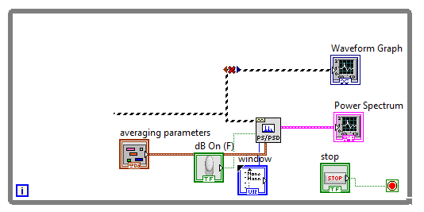
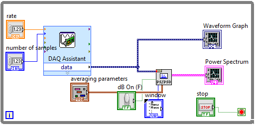
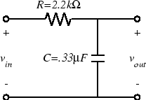

ELEC 240 Lab

------------------------------------------------------------------------

Experiment 5.2
--------------

Signal Acquisition 
------------------

### 

### Equipment

* Test board
* 2.2 $k\Omega$ Resistor
* 0.33 $\mu F$ Capacitor

### Part A: Acquiring Signals

In this section you will learn how to acquire a signal into Labview using the
Data Acquisition (DAQ) card (inside your PC) via the DAQ cable that is
connected to your lab PC:

1. Copy the VI you created from Experiment 5.1 and give it a new name.

2.	We want to modify the Block Diagram to process an external signal read via
    the DAQ cable. Delete the generated waveforms, i.e., Sine Wave and White
    Noise blocks, Add block, and Frequency and Amplitude controls.

    

    
    

3.	In the Functions palette, go to Programming $\rightarrow$ Measurement I/O
    $\rightarrow$ NI DAQmx $\rightarrow$ DAQAssist.

4.	Select Acquire Signals $\rightarrow$ Analog Input $\rightarrow$ Voltage.

5.	Select the input channel we will connect our FGEN signal to, in this case,
    A/D input 4, or ai4.

6.	At the bottom of the DAQ Assistant window that pops up, change the
    Acquisition Mode to Continuous Samples and select OK.

7.	In the Block Diagram window, connect the data output to the broken wire
    from the Power Spectrum block. Create controls for the input pins `number
    of samples` and `rate`.

    

    
    

8.	Your VI is ready to acquire signals from your test board. **Show a
    screenshot of your VI.** Connect the DAQ cable to J3-1 on your test board.

9.	Connect the output of the FGEN to CH1 of the oscilloscope and to A/D input
    4 (pin 46).

10. Set the FGEN to produce a $2 V_{ pp }$, 500 Hz sine wave.

11. In the Front Panel, set the rate to 10k and number of samples to 5k. 

12. Right-click on the time-domain waveform's x-axis to uncheck Autoscale X.
    Change the max value of the time scale by double-clicking the max number so
    that roughly 2-3 periods are displayed.

13. Change the max frequency in the power spectrum plot as well to a reasonable
    viewing window.

14. Run your VI and **take a screenshot.**

15. Add some additional information to your Front Panel, RMS voltage (called
    the Average DC/RMS block), and peak-to-peak voltage, and any other
    interesting info you might find in Labview built-ins (if you can't find
    these function blocks, use the Search feature). **Show a screenshot.**

16. **How does the display look when you disconnect the FGEN? Does your VI
    detect any noise?**

### Part B: The Spectrum of Triangle and Square Waves
1.	The Fourier series of a triangle wave has only odd harmonics, which fall
    off at the rate of $\frac{1}{n}2T$ (12 dB/octave). Turn dB option on for your
    spectral plot for better viewing. Set the function generator to produce a
    triangle wave and see if this is the case. **What happens when you vary the
    symmetry?**

2.	The square wave also consists only of odd harmonics, but falling off as
    $\frac{1}{n}T$ (6 dB/octave). Set the function generator to square wave and
    **comment on the spectrum.** Vary duty cycle. **What do you observe?**
    Depending on the exact frequency you may see a number of extraneous
    harmonics. These are due to the phenomenon of *aliasing* which we will
    examine later.

3.	Your spectrum analyzer displays magnitude and frequency on a linear scale.
    It is sometimes useful to view the spectrum on a semi-log or log-log plot.
    Stop executing the program, right-click on the spectrum display (gray area)
    and click on Properties $\rightarrow$ Scales. Select Log. Adjust the
    amplitude if necessary to obtain a good display. **Do you notice the
    hyperbolic shape in which the harmonics fall off?**

4.	Now get a log-log plot with magnitude in dB by changing the Y-scale to Log
    and setting a multiplier of 20 (under Scale Factors). **Note that the $1/f$
    fall off is now a "linear" 20 dB/decade slope.**

5.  Switch the function generator to a triangle wave. **Is the slope now 40
    dB/decade?** Set the spectrum analyzer back to linear display (both 
    magnitude and frequency). Note the shape of the spectrum.

6.	Set the function generator to square wave. Set the Duty Cycle to 15%. You
    should now have a waveform consisting of narrow pulses. Note the shape of
    the spectrum. It should have the $sin(x)/x$ (sinc) shape you saw in
    ELEC241.

7.	Set the spectrum analyzer back to dB magnitude and log frequency. Set the
    duty cycle to 50%.

### Part C: The Spectrum and Frequency Response

1.	Wire the circuit below. This is the same circuit we used in Lab 3, so you
    should have its transfer function in your lab report.

    

    
    

2. Connect the output of the function generator to $v_{in}$. Also connect
   CH1 of the scope and A/D input 4 (pin 46) to $v_{in}$.

3.	Set the function generator to produce a 50 Hz sine wave at 1 $V_{rms}$.

4.	Move CH1 of the scope and A/D input 4 to $v_{out}$.

5.	Increase the frequency of the function generator and observe the behavior
    of the spectrum display. The tip of the peak corresponding to the
    fundamental of the sine wave will trace out the magnitude of the transfer
    function of our circuit.

6. Since the transfer function falls off as $1/f$ for high frequencies, we
   expect the output to fall 6dB/octave (an octave is a factor of two) for
   frequencies well above the cutoff frequency T. **Check the response at 1
   kHz, 2 kHz, and 4 kHz and see how well this holds.**

7. Turn off the function generator.
