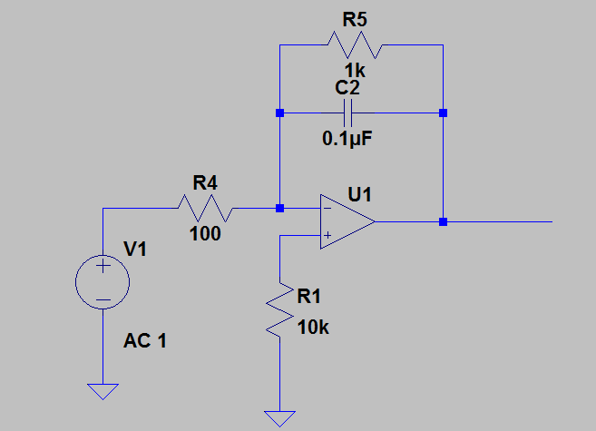

ELEC 240 Lab

------------------------------------------------------------------------

Experiment 5.2
--------------

Frequency Response
------------------

### Equipment

* Test board
* Integrator from last experiment
* 1kΩ and 100Ω resistors
* Lab computer or laptop

### Part A: Measuring Frequency Response

In this part of the lab you will use look at the frequency response of your
integrator.

1. Disconnect the input and output from your integrator and modify it as shown
   below. For the input, connect a $1 V_{pp}$ sinusoidal signal from your
   VirtualBench function generator.

    

    
    

2. Record output peak-to-peak voltage values for the following frequencies:  
    * 10Hz
    * 100Hz
    * 500 Hz
    * 800 Hz
    * 1kHz
    * 1.5kHz
    * 2kHz
    * 5kHz
    * 10kHz
    * 50kHz

3. Calculate the gain in decibels (dB) for your circuit at each of these
   frequencies

    !!! tip
        $$
        \text{Gain}(dB) = 20*log_{10}\left(\frac{Vout}{Vin}\right)
        $$

4. Plot $\text{Gain}(dB)$ vs. $\text{Frequency}(Hz)$ in Matlab. At what frequency does
   the gain begin to drop?

5. **Does the cutoff frequency, $f_c$ roughly equal $\frac{1}{2*\pi*R5*C2}$?**

### Part B: Circuit Simulation

The remainder of the lab can be done from a computer (lab computer or personal
laptop). We will be using circuit simulation software called LTSpice. Spice
stands for (Simulation Program with Integrated Circuit Emphasis).

1. Download LTspice from linear.com. There are Windows and Mac versions
   available. Please note that the instructions below are specifically for
   Windows.

2. Click on New Schematic and create the same circuit you built on your
   breadboard shown above.  Refer to the [tips](../references/using-spice) in
   the references section for help with Spice.

3. The component opamp is just a symbol of an opamp and in order for Spice to
   see the model, you need to place a Spice Directive calling the location:
   Edit $\rightarrow$ Spice Directive. Then enter `.lib opamp.sub`

4. Set the voltage source to AC by right-clicking it and selecting Advanced.
   Set AC amplitude to 1.

5. Enter in $R$ and $C$ values by right-clicking these components.

    !!! tip
        Optionally label nets (i.e., wires) by right-clicking on nets.

6. Perform an AC analysis using the [ instructions ](../references/using-spice)
   provided in the references section. An AC analysis will evaluate the gain
   (Vout/Vin) and phase over a specified range of frequencies and plot it.

7. Click on the `Vout` node for gain and phase plots to appear. You will notice
   that the gain is displayed in dB and phase in degrees. The x-axis will be
   logarithmic, i.e., the step size is $10n$, where $n$ is a non-negative
   integer. Each of the steps is called a decade (`dec`).

8. **Take a screenshot of your plots.**

9. **What is the gain at low frequencies? What is the cutoff frequency?  What
   is the slope of the gain with respect to frequency for high frequencies
   (express in terms of dB/dec)? Do these values match what you measured on
   your breadboard?**

10. **What is the phase for very low frequencies? At 0dB? And for very high
    frequencies? Can you explain why?**
