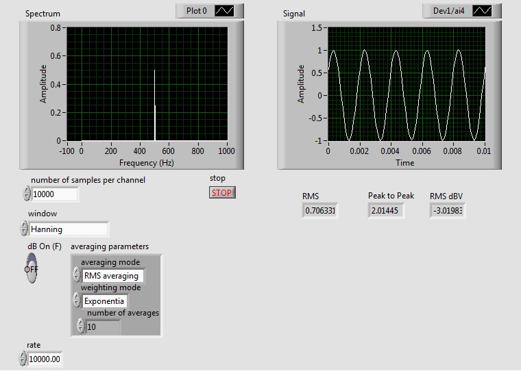

ELEC 240 Lab

------------------------------------------------------------------------

Experiment 6.1
--------------

Measuring a Signal's Spectrum
-----------------------------

### 

### Equipment

* Test board
* 2.2 kΩ Resistor
* 0.33 µF Capacitor

### Part A: The Spectrum of a Sine Wave

The spectrum of a sine wave should be pretty boring. By definition it consists
of a single component at the fundamental frequency whose amplitude is equal to
the amplitude of the waveform. Nevertheless, it is useful being able to see the
amplitude and frequency in a single picture, as well as being able to assess
how "pure" (i.e. how truly sinusoidal) the purported sine wave actually is.

1. Connect the cable from the DAQ card to J3-1 on the rightmost interface
   module.

2. Connect the output of the function generator to CH1 of the scope and to A/D
   input 4 (pin 46 on the bottom interface board socket connector).

3. Set the function generator to produce 2 V p-p, 500 Hz sine wave.

4. Download the [spectrum analyzer](../labview/Lab6_Spectrum_Analyzer.vi) and
   open in Labview. Set "number of samples per channel" and "rate" to
   10000. Set "averaging mode" to RMS averaging.

5. Start the instrument by selecting Run from the Operate menu, or by pressing
   the run button (the small arrow just below the menu bar). The instrument is
   divided into a display area (the large black area on the left with green
   lines and text) and a control area (the gray area on the right). For now,
   let's concentrate on the display area. It should look something like this:

    

    
    

6. The top portion is the waveform display. It should be showing a sine wave,
   just like the scope. Vary the function generator amplitude control and
   verify that these values change appropriately.

    !!! note
        There is some additional information about the signal just above the
        waveform display. The line labeled 'Signal Amplitude' gives three
        different measurements of the signal amplitude. Vrms: the RMS voltage;
        dBV: the RMS voltage in decibels relative to 1V; Vp-p: the peak-to-peak
        voltage.

7. Disconnect the function generator. What remains is a *noise* signal which is
   being generated within the rest of the system. In this case it has both a
   *random* component (the "grass") and a periodic component (the 3.3 kHz
   signal).

8. Reconnect the function generator. **Vary the frequency and observe how the
   spectrum display changes**.

### Part B: The Spectrum of Triangle and Square Waves

1. The Fourier series of a triangle wave has only odd harmonics, which fall off
   as $\frac{1}{n}^2$ (12 dB/octave). Set the function generator to produce a
   triangle wave and see if this is the case. **Are there any even harmonics?
   If so, why are they there? What happens when you vary the duty cycle?**

2. The square wave also consists only of odd harmonics, but falling off as
   $\frac{1}{n}$ (6 dB/octave). Set the function generator to square wave and
   observe the spectrum. Vary duty cycle. Depending on the exact frequency you
   may see a number of extraneous harmonics. These are due to the phenomenon of
   *aliasing* which we will examine later.

3. The spectrum analyzer labeled "Spectrum" displays magnitude and frequency on
   a linear scale. It is sometimes useful to view the spectrum on a semi-log or
   log-log plot. Stop executing the program, right-click on the spectrum
   display (gray area) and click on Properties $\rightarrow$ Scales.  Select
   Log. Adjust the amplitude if necessary to obtain a good display.  Note the
   hyperbolic shape of the $\frac{1}{n}$ fall off in magnitude.

4. Now get a log-log plot with magnitude in dB by changing the Y-scale to Log
   and setting a multiplier of 20 (under Scale Factors). Note that the
   $\frac{1}{f}$ fall off is now a "linear" 20 dB/decade slope.

5. Switch the function generator to triangle wave. **Is the slope now 40
   dB/decade, as we expect?** Set the spectrum analyzer back to linear display
   (both magnitude and frequency). Note the shape of the spectrum.

6. Set the function generator to square wave. Set the Duty Cycle to 15%.  You
   should now have a waveform consisting of narrow pulses. Note the shape of
   the spectrum. It should have the $sin(x)/x$ (sinc) shape you saw in ELEC241.

7. Set the spectrum analyzer back to dB magnitude and log frequency. Set the
   duty cycle to 50%.

### Part C: The Spectrum and Frequency Response

1. Wire the following circuit:

    

    
    

    !!! note
        This is the same circuit we used in Lab 3, so you should have its
        transfer function in your lab notebook.

2. Connect the output of the function generator to $v_{in}$. Also connect CH1
   of the scope and A/D input 4 to $v_{in}$.

3. Set the function generator to produce a 50 Hz sine wave at 1 $V_{rms}$ (0
   dBV).

4. Move CH1 of the scope and A/D input 4 to $v_{out}$.

5. Increase the frequency of the function generator and observe the behavior of
   the spectrum display. The tip of the peak corresponding to the fundamental
   of the sine wave will trace out the magnitude of the transfer function of
   our circuit. Note the two numbers above the spectrum display. They give the
   magnitude and frequency of the largest peak in the spectrum. The "Peak
   Frequency" readout should correspond to the frequency setting of the
   function generator.

6. Since the transfer function falls off as $\frac{1}{f}$ for high frequencies,
   we expect the output to fall 6 dB per octave for frequencies well above the
   cutoff frequency. **Check the response at 1 kHz, 2 kHz, and 4 kHz and see
   how well this holds.**

7. Turn off the function generator.
