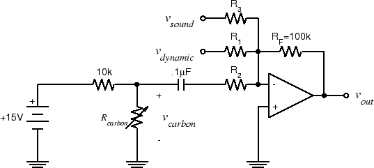

ELEC 240 Lab

------------------------------------------------------------------------

Experiment 6.2
--------------

The Spectrum of Acoustic Signals
--------------------------------

### Equipment

* Test board
* Telephone handset
* Mobile phone

### Part A: The Spectrum of Speech Signals

1. Connect the power supply to your breadboard (if you haven't already done
   so), plug the dynamic microphone into J1-6, and verify that the mixer
   circuit you build last week still works.

2. Connect CH1 of the scope and A/D input 4 to $v_{out}$ of the mixer circuit.

3. Set the spectrum analyzer to dB magnitude scale and Linear frequency scale.

4. Produce a sustained vowel (a, e, i, o, u) sound. Note the form of the
   spectrum. It should consist of a series of peaks, like the signals from the
   function generator, but unlike the function generator signals where the
   harmonics fall off monotonically, the amplitudes of the harmonics in a
   speech signal rise and fall with increasing frequency.

5. To make it easier to study the spectrum, you can "freeze" the display by
   pressing the STOP button (continue producing the sound until the freezing is
   complete). If you like, you can get a printout of the display by selecting
   "Print Window" from the File menu.

6. Estimate the fundamental frequency (pitch) of the waveform. Notice that
   unlike the function generator signals, the fundamental is not necessarily
   the strongest component. 
   
    !!! tip
        It may be difficult to get an accurate estimate if the fundamental is
        low in frequency (e.g. a male voice). One way to improve accuracy is to
        find the frequency of one of the higher harmonics and divide by its
        order.

7. While trying to keep the same pitch, produce different sustained vowel
   sounds. Note how the "envelope" of the spectrum (the line connecting the
   tips of the peaks) changes while the positions of the lines remains the
   same.

8. Now, produce the same sustained vowel sound (your choice) while varying the
   pitch. Notice how the overall shape of the spectrum remains the same as the
   lines move up and down.

9. Play some music from a single musical instrument from your phone, into the
   microphone. Note the nature of the spectrum.

10. A soft whistle should be very close to a pure tone. Whistle a tone of about
    1 kHz into the microphone and see if this is the case.

11. Plug in the telephone handset. Verify that the carbon microphone input to
    the mixer still works by speaking into the handset microphone.

12. Whistle the same note into the handset microphone and observe the spectrum
    display. Does it have the same harmonic content as with the dynamic
    microphone? Since the acoustic signal was the same, the difference must be
    caused by distortion in the microphone. **Which microphone has the least
    distortion?**

13. Blow into the microphone and note the shape of the spectrum. This is a
    *broadband*, random signal.

14. Produce an 'sh' sound. Note the shape of the spectrum. This is called an
    *unvoiced fricative*.

15. Now try a 'zh' sound (a *voiced fricative*). How does its spectrum compare
    with the one in the previous step?

16. Based on your observations of different speech sounds, **can you determine
    an approximate bandwidth for speech?** i.e. is there a frequency below
    which "most" of the energy of the speech signals is concentrated?

### Part B: Analyzing an Unknown Signal

1. Plug the sound card cable from the Lab PC into J2-1.

2. We want to be able to hear the signal, so connect one side of the handset
   earpiece to the mixer output. Ground the other side of the handset earpiece.

3. To play the sound card through our mixer, we will need to add a third input.
   To do this, add a 100-$k\Omega$ resistor ($R_3$) to the mixer circuit so that it
   looks like this:

    

    
    

4. Connect the sound card line out (pin 20 on the interface board socket strip)
   to $v_{sound}$.

5. Unplug the dynamic microphone from J1-6. Unscrew the cover from the
   mouthpiece of the telephone handset, and remove the microphone cartridge.
   Now the only input to the mixer is from the sound card.

6. Download and play the [Mystery Signal](./signals/shepard30.au) from Lab
   2 (with any Windows default player). You should be able to hear it through
   the earpiece and see it on the spectrum analyzer display.

    !!! tip
        It may be easier to see what's going on if you set the spectrum
        analyzer display to linear magnitude and log frequency.

7. Based on what you see on the spectrum display, can you explain how the
   mystery signal works? Hint: focus on a single peak and note how it changes
   from one tone to the next.

8. Put the telephone handset back together.

9. Exit the spectrum analyzer program. Disconnect the DAQ cable from the
   interface board by using the ejector levers. 
   
    !!! caution
        Do not try to remove it by pulling on the cable.
