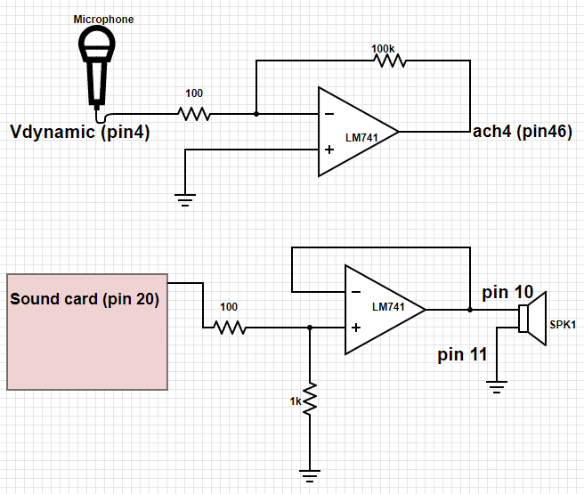

ELEC 240 Lab

------------------------------------------------------------------------

Experiment 6.2
--------------

The Spectrum of Acoustic Signals
--------------------------------

### 

### Equipment

* Telephone handset
* Dynamic microphone
* Test board
* A musical instrument if you have one!

The first step in batch processing is to record the input signal as a disk file. We will use a Labview program to do this, then use Matlab to do the signal processing itself.

### Part A: Digital Recording

1. Connect the cable from the DAQ card to J3-1 on the rightmost interface module. Plug the sound card cable into J2-1. Plug the phone handset into J1-7.

2. Build the following two circuits. The top one will be used to amplify and record your voice via the dynamic microphone, and the bottom one will play back audio from the computer to the phone handset. 

3. Verify that the audio output out of the handset is working by playing this [test signal] (./signals/sine.au).

4. Download [Recorder] (./labview/Recorder.vi) and open in Labview. This program will record four seconds of a signal to a file.

5. Make sure Dev1 is selected as your device name. Start the program by pressing the Run button or CTRL-R.

6. When ready to record, press the START RECORDING button. Wait for the green indicator to come on and speak a significant phrase (e.g. "My labbies are so great") into the microphone. You should see the signal on the waveform chart as it is being recorded.

7. After four seconds a window will pop up asking you to save the signal to a file. Save it as sig1.tdms. The default location will be in the C drive under folder Temp.

8. Navigate to the saved file and right-click on the file. Select Open With -> Excel Importer.

9. Go to the sheet called Untitled. You will see the sampled data there. Note that the samples have been scaled so that their value corresponds to the signal value in volts. Save the excel file as sig1.xlsx and close.

10. Make a second recording of a series of tones with a "simple" harmonic structure. For example, whistling a tune, playing a musical instrument, or playing a pure tone via your smart phone (find an app or search on youtube). Save this as sig2.xlsx.

### Part B: Loading the Signals into Matlab

1. Load Matlab from the Start menu by going to All Programs -> Matlab -> Matlab R2017a. (You could also transfer the files to your laptop and work with Matlab on your own computer.)

2. Our signals were recorded with a sampling rate of 10 kHz. We can create a Matlab variable for the sampling frequency: 
>> Fs=10000;

3. Select the button "Import Data". Navigate to the data location and double-click on the file "sig1.xlsx". Click on Import Selection.

4. You should now have a table of values named something like "sig1S1". Convert it from a table to an array of values with the command:
>> sig1=table2array(sig1S1)

5. Play it back by typing the following command: 
>> sound(sig1, Fs)

6. **What happens if you reduce Fs by half?**

7. Repeat steps 3-5 for your second signal (sig2).

### Part C: Spectral Analysis

1. Display the spectrogram of your signal and **take a screenshot:**
>> specgram(sig1, 256, Fs)

2. The number n=256 in the above command is the length of the signal chunk used in computing the Fourier transform. For our sample rate of 10 kHz, **what is the time resolution (n/fs)? What is the frequency resolution (fs/n)?**

3. We can get finer resolution in time or frequency (but not both at the same time) by decreasing or increasing this number. Try values of 128 and 512 and **comment on what difference they make in the spectrogram.** With 512 you should be able to see the individual harmonics of the pitch frequency. If you have a low pitched voice, you may be able to see the individual pitch pulses with length 128. Can you distinguish the voiced from the unvoiced sounds?

4. **What are the time and frequency resolutions corresponding to these transform lengths?** 

!!! hint
The figure() command allows you to display several plots or spectrograms at one time. The commands 
>> figure(2) 
>> specgram(sig1, 128, Fs) 
will create a new plot window (Figure 2) and display the new spectrogram in it. To go back to Figure 1, just type figure(1).

5. The spectrogram is simply a concatenation of the spectra of individual chunks of the signal, which we can compute individually. Use the time scale on the spectrogram to find a strong voiced region of the signal (say, for example at t=1.5 sec). Since the sampling rate is 10 kHz, this corresponds to a sample index of t*10000 (15000 in our example). Extract a chunk of length 256 from the signal at this point: 
>> chunk=sig1(15000:15255);

6. Examine your chunk with the plot command: 
>> plot(chunk)

7. Now take the DFT of this chunk of the signal: 
>> spectrum = fft(chunk);

8. Let's first try to plot the spectrum in the “obvious” way:
>> plot(spectrum)

9. The result is not how we expected. The spectrum is a complex valued sequence, and Matlab plots complex functions as the real vs. imaginary part. A better picture is: 
>> plot(abs(spectrum))

10. Note that this plots both positive and negative frequencies. To get a more traditional plot: 
>> plot(abs(spectrum(1:129)))

11. Can you see the shape of this curve in the spectrogram at the point where you took your chunk? The spectrogram uses a logarithmic scale for magnitude, so you might try 
>> plot(log(abs(spectrum(1:129)))) 
or 
>> semilogy(abs(spectrum(1:129)))
**Take a screenshot.**

12. Display the spectrogram of your “musical” signal 
>> specgram(sig2, 256, Fs)

13. **Can you identify the individual notes in the tune?**

14. Different instruments have different harmonic structures: a flute has few harmonics, an oboe or trumpet has many, a clarinet has no even harmonics. **Analyze the harmonic structure of your tones.**

